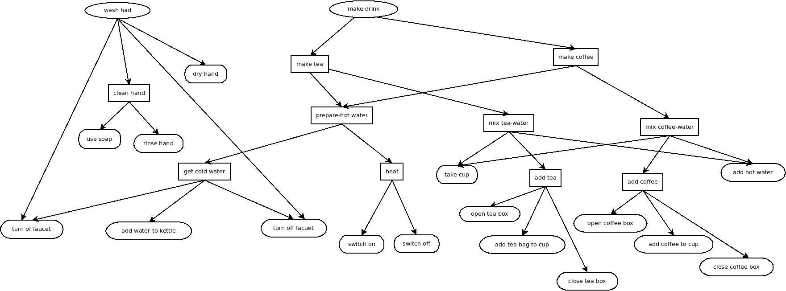

Algorithm Implementation record
-------------------------------
#Summary#
 This document record the progress of implementing the goal recognition algorithm, including details and modifications during each stage.
 
##July 18##

 - **explaSet**=[]: explanations for all the previous observations. Before initialization, this set has a length of 0, at this case, we need to initialize the explaSet according to the knowledge base;
 - *code knowledge base example according to the drawn dia figure*, complete the hand washing part.
 

  

##July 19##
 - Initialize the explanation set (explaSet)
	 - Step 1: search in "method" collection who has a property of "start_action"
	 - Step 2: for all the returned entries, check if their preconditions are satisfied in the current state
	 - Step 3 : generate the pending set and initialize the explaSet.
 - Initialize the explanation Set (explaSet): didn't finish, only store the updated knowledge base into mongoDB

##July 20##
 - realize explaSet initialization. 

##July 21##
 - create a database class, inside this class, all database related search and operations are included. 
 - calculate action posterior prob based on s(t-1), and o(t), for a given action:
	 - Step 1,  create a list for all it's related object attribute
	 - Step 2, create a list of all possible attribute value combination
	 - Step 3, Bayesian variable elimination to calculate posterior(a)

##July 22##
 - define p(s_t|s_t-1, a_t)
	 - assume that if an action has been implemented, it will ben 100% succeed. 
	 - So **if** precondition(a_t) is satisfied in s_(t-1), and effects(a_t) is satisfied in (s_t), p(s_t|s_t-1, a_t)=1, **else**,  p(s_t|s_t-1, a_t)=0. 
 - calculate p(a_t) give observation
	 - The final p(a_t)[variable elimination] is given by normalizing on (**a_t happened**) and (**a_t not happen**)
	 - for the whole explanation set, calculate **prior(a_t)*posterior(a_t)[variable elimination]**, and then normalize over all the actions in all of the pending set
 - move notification to a class, every time the engine need notification, get it from the class instance.
 - *need to finish belief state update*
